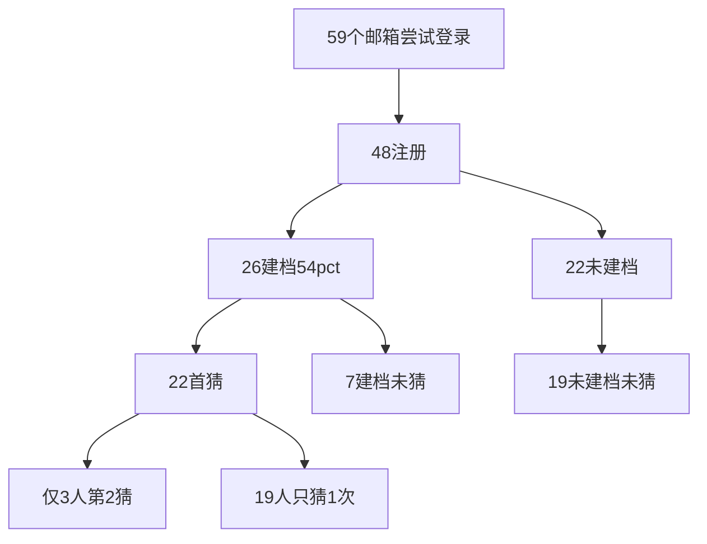

# WC2026 线上增长诊断报告

**分析时间：** 2026-06-17（数据库服务器时间）  
**样本：** 全部 48 名注册用户（不排除任何账号）  
**数据来源：** 线上 PostgreSQL 只读查询（`deploy/growth_analysis_result.json` 为原始 JSON）

---

## 一、一句话结论

**你不是「推广完全没人来」，而是「来了约一半只玩一次、甚至只注册就跑了」——最大瓶颈在留存和第二猜，不在 SEO 或功能多少。**

6 月 15–16 日你群发后确实拉到了人（两天 35 个新注册），但 **54% 的人从未竞猜过**，**86% 的人竞猜不超过 1 次**，签到习惯几乎没建立。世界杯正赛即将开打（6/19 墨西哥 vs 韩国等），这是接下来 2 周翻盘窗口。

---

## 二、数据快照

| 指标 | 数值 | 对照目标（GROWTH_OPS） |
|------|------|------------------------|
| 注册用户 | **48** | 冷启动阶段 |
| 建档完成 | **26（54%）** | 目标 >65% ❌ |
| 至少竞猜 1 次 | **22（46%）** | 目标 >40% ✅ 略达标 |
| 24h 内首猜 | **22/22（100%）** | 来猜的人当场就猜了 |
| 竞猜 ≥2 次 | **3（6%）** | 无官方目标，但极低 ❌ |
| 从未竞猜 | **26（54%）** | 最大流失池 |
| 从未签到 | **34（71%）** | 每日习惯未形成 ❌ |
| 近 7 日活跃 | **31（65%）** | 含注册当日访问 |
| 邀请注册占比 | **14/48（29%）** | 裂变有起色 |
| 有效邀请（首玩里程碑） | **8** | K≈0.17/人，接近 0.15 目标 ✅ |
| 付费成功订单 | **4 笔 / 2 人** | 极小，冷启动正常 |
| 积分商城兑换 | **0** | 几乎无人攒够分 |
| 竞猜猜中 | **2 条 / 1 人** | 正反馈极弱 ❌ |

**注册曲线（按天）：**

| 日期 | 新注册 |
|------|--------|
| 6/11 | 8 |
| 6/12 | 4 |
| 6/14 | 1 |
| **6/15** | **20** |
| **6/16** | **15** |

→ 6/15 的推广 burst 有效；问题在 burst 之后**没有把人养成「第二天再来」**。

---

## 三、漏斗拆解：问题出在哪一层



### 1. 获客层：不是主矛盾

- 验证码：发出 72 次，使用 58 次，**59 个不同邮箱**尝试 → **48 人注册**
- 注册转化率约 **81%**（48/59），说明「愿意点进来的人大部分能注册成功」
- **结论：** 继续纯靠你个人群发可以慢慢涨，但已有渠道没有「完全堵死」

### 2. 激活层：半好半坏

**好的：**
- 46% 首猜率，略高于 40% 目标
- 所有首猜都在注册 24 小时内完成（中位 0 小时）→ Tour/当场引导对「愿意玩的人」有效

**坏的：**
- **19 人**：未建档 + 未竞猜（39%）→ 进来逛一圈就走
- **7 人**：已建档但从未竞猜 → 建档 CTA 后仍流失
- 建档率 54%，低于 65% 目标

### 3. 留存层：**当前最大瓶颈**

| 竞猜次数 | 用户数 |
|----------|--------|
| 0 次 | **26** |
| 1 次 | **19** |
| 2 次 | 1 |
| 7 次 | 1 |
| 11 次 | 1 |

- **40 人（83%）竞猜 ≤1 次** → 典型「一次性体验」
- 仅 **14 人（29%）**  ever 签到，最长连签 **2 天**
- 问答任务：仅 **5 人** 参与
- D7 留存：**尚无样本**（全员注册未满 7 天，6/11 首批用户 6/18 才能看 D7）

### 4. 裂变层：意外还行

- 14 人通过邀请码注册（29%）
- 5 个邀请人，其中 QQ 用户 `351531542` 有效邀请 3 人表现最好
- 有效首玩里程碑 8 个 → **K ≈ 0.17**，接近目标
- **注意：** 有一个 disposable 邮箱账号拉了 5 个绑定，有效 5 个——需观察是否刷号；若是真人小号也说明「会拉人的用户存在」

### 5. 变现层：可以后置

- 4 笔支付成功（均为 6 元小包 SKU），2 个付费用户
- 1 笔取消、1 笔 pending
- 积分商城 **0 兑换**；全站仅 **1 人** 有可用积分（最高 35 分）
- 竞猜结算：**22 输 / 15 待开奖 / 2 赢** → 几乎没人体验过「猜中高潮」

### 6. 功能使用：AI 抢走了注意力

| 用户群 | 人数 | 用过 AI |
|--------|------|---------|
| 竞猜过 | 22 | 4 |
| **从未竞猜** | **26** | **7** |

→ **7 个从未竞猜的用户却用了 AI 分析**——说明不少人被「AI/首页」吸走，没进竞猜闭环。这与早期 Tour 去 AI 的产品问题一致（虽已改，老用户路径习惯仍在）。

### 7. 赛程与时机

- 104 场比赛，**16 场已有比分/结束**
- 竞猜高度集中在 **已结束场次**（某场 16 次竞猜、4 次等）→ 赛前用户在「练手」或误猜已结束比赛
- **6/19 墨西哥 vs 韩国** 等正赛将开 → 这是第一次真正的「比赛日事件」

---

## 四、瓶颈排序（按优先级）

### 瓶颈 1：「只玩一次」——留存（严重）

- 19 人只猜 1 场，3 人猜 2 场以上
- 没有猜中反馈（全站 2 次猜中）、没有比赛日节奏 → **没有理由第二天打开**

### 瓶颈 2：「注册但不猜」——激活后半段（严重）

- 26 人从未竞猜（54%）
- 其中 7 人已建档 → **应点对点私聊追一次**

### 瓶颈 3：「签到/任务没养成」（中等）

- 71% 从未签到
- 每日任务设计有了，但用户不知道或不在乎

### 瓶颈 4：「推广方式偏广撒网」（中等）

- 6/15 burst 证明群发有效，但链接若只到首页，会放大「未竞猜」比例
- 应全部改为 **深链 `/predict?highlight=场次ID`**

### 瓶颈 5：变现/积分商城（可忽略）

- 用户量与猜中次数都不支撑付费和兑换

---

## 五、为什么感觉「推广不出去」

| 你的感受 | 数据真相 |
|----------|----------|
| 人好少 | 48 人、6 天，冷启动正常；6/15 一天 +20 说明渠道能通 |
| 发了没人理 | 59 邮箱尝试 → 48 注册，其实 **81% 来了就注册** |
| 产品不行 | **46% 首猜达标**；差的是 **第二猜和签到** |
| SEO 没用 | 周期 4–8 周，且当前瓶颈在激活/留存不在曝光 |
| 付费没人 | 2 人付费，在 48 人池里已算探路 |

**核心：** 你在用「推广新 App」的体力，打的是「养成习惯」的仗——**第一次拉人有效，第二次没人回来**。

---

## 六、接下来 2 周可执行动作（运营向，不堆新功能）

### 第 1 周（6/17–6/23）：正赛开踢前

1. **私聊追 26 个从未竞猜用户**（QQ/微信）  
   话术：「你的 100 币和今日免费猜还没用，墨西哥 vs 韩国 6/19 开猜了 → [直达竞猜链接]」

2. **所有群发文案统一模板**（禁止只发首页）  
   ```
   6/19 09:00 墨西哥 vs 韩国 开猜了
   免费猜一场，猜中拿积分换头像框
   https://loveaibaby.cn/predict?highlight=1
   ```

3. **6/18 晚 + 6/19 早 两波提醒**  
   开赛前 2h 链接 + Live 链接（见 GROWTH_OPS 比赛日节奏）

4. **盯 7 个「建档未猜」用户**  
   他们离激活最近，单独 @ 一次

5. **让猜过 1 次的人晒预测**  
   找 3–5 个活跃 QQ 用户，提交后让他们发海报到群（你已有 PredictShareSheet）

### 第 2 周（6/24–6/30）：第一比赛周复盘

1. **6/18 起每天看 D7**（6/11  cohort 满 7 天）  
   目标：D7 签到/竞猜代理 >15%

2. **比赛日 vs 非比赛日 DAU**  
   用 `game_predictions.created_at` 按日对比

3. **积分商城 SQL 已更新后**，在群里说：「猜中 7 场左右能换入门徽章（100 分）」

4. **邀请表现好的用户**（如有效邀请 3 人的 QQ 用户）当「团长」——给专属话术和 highlight 链接

5. **暂缓买量、暂缓大功能**；把「第二猜率」从 6% 拉到 20% 再考虑扩渠道

---

## 七、每周复盘 SQL / API

```bash
# 漏斗 API
curl -H "X-Admin-Secret: YOUR_SECRET" \
  "https://loveaibaby.cn/api/game/admin/funnel-summary?days=7"

# Navicat 重跑全套
# 执行 deploy/analyze_growth_readonly.sql

# Python 一键（密码用环境变量，勿写进文件）
set GROWTH_SSH_HOST=106.54.231.30
set GROWTH_SSH_USER=ubuntu
set GROWTH_SSH_PASSWORD=***
set GROWTH_DB_PASSWORD=***
py -3.12 backend/scripts/analyze_growth.py
```

---

## 八、安全提醒

你在对话中暴露过 **SSH 与数据库密码**，分析完成后请尽快：

1. 修改服务器 `ubuntu` 登录密码  
2. 修改 PostgreSQL `wc2026` 用户密码  
3. 更新 Navicat 连接配置  
4. **勿将** `growth_analysis_result.json` **提交到公开仓库**（含用户邮箱）

---

## 九、与产品改动的关系

近期已做的增长改造（Tour 去竞猜、分享海报、WinFeed、连胜条等）**方向正确**，但：

- 48 用户里大部分在改造前/中注册，行为数据还体现「旧习惯」
- **6/19 起**才是验证改版是否有效的第一场大考
- 数据支持继续推 **竞猜深链 + 比赛日节奏**，而不是再加复杂社交功能

**判断标准（2 周后）：**

| 指标 | 当前 | 2 周目标 |
|------|------|----------|
| 首猜率 | 46% | 保持 ≥45% |
| 竞猜 ≥2 次占比 | 6% | **≥20%** |
| ever 签到占比 | 29% | **≥40%** |
| 有效邀请 K | 0.17 | **≥0.20** |
| 6/19 比赛日 DAU | — | **≥15** |

---

*本报告由只读数据库诊断自动生成，计划详见 Cursor 规划「线上数据库增长诊断」。*
