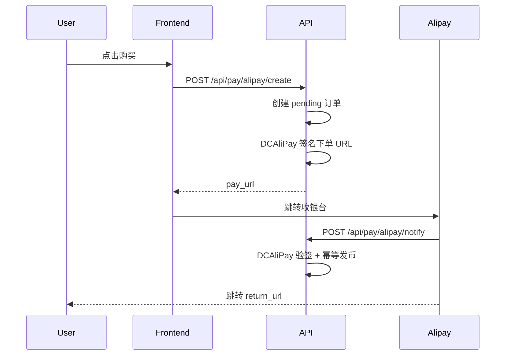

# 支付宝接入指南（公钥证书模式）

本项目使用 **公钥证书模式** + `python-alipay-sdk` 的 `DCAliPay`，**不支持**旧的「公钥/密钥模式」（`AliPay` + 支付宝公钥字符串）。

## 环境变量

```bash
ALIPAY_APP_ID=你的AppID
ALIPAY_PRIVATE_KEY_PATH=keys/alipay_app_private.pem
ALIPAY_APP_CERT_PATH=keys/appCertPublicKey.crt
ALIPAY_ALIPAY_CERT_PATH=keys/alipayCertPublicKey_RSA2.crt
ALIPAY_ROOT_CERT_PATH=keys/alipayRootCert.crt
ALIPAY_NOTIFY_URL=https://你的API域名/api/pay/alipay/notify
ALIPAY_RETURN_URL=https://你的前端域名/shop/result
ALIPAY_SANDBOX=false
ALIPAY_MOCK=false
```

路径可为相对路径（相对 `backend/`）或绝对路径。四份文件说明见 [`backend/keys/README.md`](../backend/keys/README.md)。

## 证书准备

开放平台 → 应用 → **开发设置** → **接口加签方式：公钥证书**

1. 本地生成应用私钥与 CSR
2. 上传 CSR，下载：
   - 应用公钥证书 `appCertPublicKey_*.crt`
   - 支付宝公钥证书 `alipayCertPublicKey_RSA2.crt`
   - 支付宝根证书 `alipayRootCert.crt`
3. 将私钥与三份证书放入 `backend/keys/`，并在 `.env` 中配置路径

**沙箱**与**生产**使用不同的 AppID 与证书包；开发时可 `ALIPAY_SANDBOX=true` 配沙箱证书。

## 支付流程



1. `POST /api/pay/alipay/create` 创建 `orders`（pending），返回 `pay_url`
2. 用户在支付宝完成支付
3. 支付宝 `POST /api/pay/alipay/notify` 异步通知 → 证书验签 → 幂等发币
4. 用户跳转 `ALIPAY_RETURN_URL`，前端可 `GET /api/pay/orders/{id}` 确认

## 开发 Mock

未配齐证书或 `ALIPAY_MOCK=true` 时，创建订单返回带 `mock=1` 的 URL，前端在开发环境调用 `POST /api/pay/alipay/mock-pay` 模拟到账。

生产环境（`PRODUCTION_MODE=true`）会强制关闭 `ALIPAY_MOCK`，并校验四份证书文件齐全。

## 网关

| 环境 | `ALIPAY_SANDBOX` | 网关 |
|------|------------------|------|
| 沙箱 | `true` | `https://openapi.alipaydev.com/gateway.do` |
| 生产 | `false` | `https://openapi.alipay.com/gateway.do` |

## 常见错误

| 现象 | 可能原因 |
|------|----------|
| 验签失败 | 使用了密钥模式的支付宝公钥 PEM，而非三份证书 |
| 下单失败 | AppID 与证书不匹配（沙箱/生产混用） |
| 生产启动报错 | 缺证书文件或未关 `ALIPAY_MOCK` / `ALIPAY_SANDBOX` |
| notify 无到账 | `ALIPAY_NOTIFY_URL` 非 HTTPS 公网地址，或防火墙拦截 |

## 幂等

- `out_trade_no` 唯一
- notify 重复时若 `orders.status=paid` 直接返回 `success`
